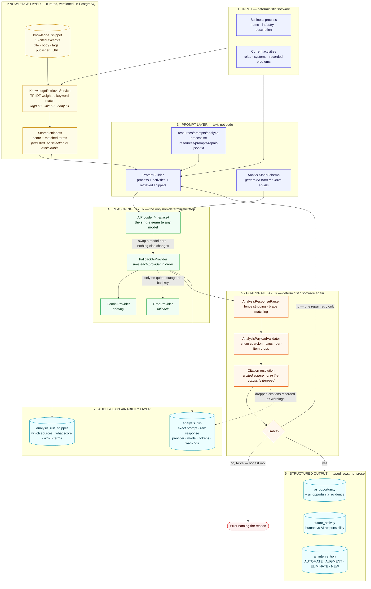

# AI architecture

How intelligence is arranged inside the system: where the knowledge comes from, where the model sits,
what guards it on either side, and what is deliberately left to ordinary deterministic software.

The governing idea is that **exactly one step is non-deterministic**. Everything before it prepares
grounded input; everything after it refuses to trust the output until it has been checked. The model
is a bounded component with software on both sides, not the application.

> Also available as a full-resolution image: [`diagrams/ai-architecture.png`](diagrams/ai-architecture.png)
> — Mermaid source in [`diagrams/ai-architecture.mmd`](diagrams/ai-architecture.mmd).

## Software or model — who decides what

The split is deliberate and it is the reason the system behaves predictably.

| Decided by ordinary software | Decided by the model |
|---|---|
| Who may see or change a process | Which activities carry the most friction |
| Which sources are relevant, and their scores | Which AI capability suits a given problem |
| What the prompt contains and in what order | How high the automation potential is |
| Whether a response is well-formed and usable | What the future process looks like step by step |
| Whether an enum value is legal | Where a human must stay in the loop |
| Whether a citation points at a real source | What the benefit and the risk are |
| What is written to the database | — |

Nothing about authorisation, persistence, validity or retrieval is delegated to the model. The model
contributes judgement about the domain; the software decides what happens with it.

## The seven layers

**1 · Input.** The process, its activities, the roles and systems involved, and any pain points the
business already recorded. Plain CRUD, fully validated before anything AI-related runs.

**2 · Knowledge.** 16 cited research excerpts stored in PostgreSQL with their publisher, URL and
tags. Retrieval is TF-IDF-flavoured keyword scoring — a term matched in a source's tags outweighs
one matched in its body, and terms common to the whole corpus are discounted. Ties break on title,
so the same input retrieves the same sources every time. The score and the matched terms are
persisted, which makes "why was this source used?" a query rather than a guess. A process from an
unrelated industry can legitimately match nothing; rather than send an ungrounded prompt, the
retriever falls back to general material and records a zero score so the fallback is visible.

**3 · Prompt.** Templates are text files in `resources/prompts/`, not string literals in Java, so
they can be read and changed without a code change. The response schema is generated from the same
Java enums the database constrains, and a test asserts the three cannot drift apart.

**4 · Reasoning.** The only non-deterministic step, reached through a single interface. A chain tries
Gemini first and falls through to Groq on quota exhaustion, outage or a bad key, with a transport
retry on 429s and 5xx. The rest of the pipeline does not know failover exists.

**5 · Guardrail.** Nothing the model returns is trusted. The parser recovers JSON from a chatty or
fenced response. The validator coerces the paraphrases models actually produce, applies caps, and
drops individually broken items rather than discarding a good analysis — every drop recorded as a
warning. Citations are resolved against the corpus, and one that points nowhere is removed. If
nothing usable survives, one repair retry runs with the specific errors fed back; if that fails too,
the request returns an honest error naming the reason rather than a plausible fabrication.

**6 · Structured output.** Typed rows with foreign keys — opportunities with evidence links, future
activities split into human and AI responsibility, interventions classified as automate, augment,
eliminate or new. Queryable, countable, comparable.

**7 · Audit and explainability.** The exact prompt, the exact raw response, which sources were
retrieved with their scores and matched terms, the token counts, whether the repair retry was
needed, which provider actually answered and why an earlier one was passed over. This is what turns
"the output is generated, not hard-coded" from a claim into something anyone can verify with SQL.

## Porting to another domain

Nothing in the pipeline is specific to the demo domain. Moving to a different industry means
replacing the rows in `knowledge_snippet` with sources for that field and, optionally, adjusting the
wording of one prompt template. No schema change, no code change, no redeploy — the abstractions the
model reasons over (activity, problem, opportunity, intervention, human-versus-AI responsibility)
are universal to process work. That claim is exercised on every demo by creating a process from an
unrelated industry and analysing it with no preparation.
