# AI architecture

How intelligence is arranged inside the system: where the knowledge comes from, where the model sits,
what guards it on either side, and what is deliberately left to ordinary deterministic software.

The governing idea has not changed since the first version, but it now applies seven times over
rather than once: **every non-deterministic step has deterministic software on both sides.**
Something prepares its input from stored data, and something refuses to trust its output until it
has been checked against stored data. The models contribute judgement about a domain; they decide
nothing about what is true, what is stored, or who may see it.

One check carries more weight than all the others. A model that produces a claim must supply the
source's own words for it, and those words are then located in the page this application fetched and
stored — by string matching, in twenty lines of ordinary code. A model that will invent a quote will
also confirm one, so no model is ever asked whether its citation is real.

> Also available as a full-resolution image: [`diagrams/ai-architecture.png`](diagrams/ai-architecture.png)
> — Mermaid source in [`diagrams/ai-architecture.mmd`](diagrams/ai-architecture.mmd).

```mermaid
flowchart TB
    subgraph INPUT["1 · INPUT — deterministic software"]
        direction LR
        PROC["Business process<br/>name · industry · description"]
        ACTS["Current activities<br/>roles · systems · recorded problems"]
        GAPS["Intake stage<br/><i>names the gaps: steps with no description,<br/>activities with no recorded system</i>"]
    end

    subgraph KNOW["2 · KNOWLEDGE LAYER — gathered live, per process"]
        direction TB
        PLAN["ResearchQueryPlanner<br/>searches in the domain's own vocabulary<br/><i>deterministic template plan if the model is unavailable</i>"]
        CONN["Eleven connectors, none needing a key<br/>Bing web · Bing News · Google News · Wikipedia<br/>OpenAlex · Crossref · arXiv · Europe PMC<br/>Hacker News · Stack Exchange · Groq agentic"]
        FETCH["PageFetcher<br/>direct → text reader → search snippet<br/><i>robots.txt honoured; a blocked source is kept and labelled</i>"]
        DOC[("web_document<br/>the page text, cached a week<br/><b>what quotes are checked against</b>")]
        FALLBACK[("knowledge_snippet<br/>the curated corpus,<br/><i>used when live research finds nothing</i>")]
        PLAN --> CONN --> FETCH --> DOC
    end

    subgraph EVID["3 · EVIDENCE LAYER — where trust is earned or refused"]
        direction TB
        EXTRACT["ClaimExtractor<br/>one page → atomic claims,<br/>each with the source's own words"]
        VERIFY{"QuoteVerifier<br/><b>is the quote actually in the page?</b><br/><i>string matching, not a model's word</i>"}
        OK["verified<br/><i>may raise a grounding score</i>"]
        NO["unverified<br/><i>kept, labelled, and excluded from every score</i>"]
        CRED["CredibilityScorer<br/>source type · recency · retrievability<br/><i>explainable: the arithmetic is stored</i>"]
        CORR["CorroborationAnalyzer<br/>agreement across <b>independent domains only</b><br/>contradictions recorded, never resolved"]
        EXTRACT --> VERIFY
        VERIFY -->|"found"| OK
        VERIFY -->|"not found"| NO
        OK --> CRED --> CORR
    end

    subgraph REASON["4 · REASONING LAYER — the non-deterministic steps"]
        direction TB
        DIAG["Diagnosis<br/>problems and their root causes"]
        OPPS["Opportunities<br/><i>cite the evidence by number</i>"]
        CRIT["Critique<br/><b>a different model family</b><br/>judges the citations, not the prose"]
        DESIGN["Future design<br/>human/AI split · failure mode per step"]
        QUANT["Quantification<br/><i>supplies inputs only, never the answer</i>"]
        RISK["Risks and obligations"]
        ROAD["Roadmap waves"]
        DIAG --> OPPS --> CRIT --> DESIGN --> QUANT --> RISK --> ROAD
    end

    subgraph GATE["5 · MODEL GATEWAY — one seam, four concerns"]
        direction LR
        ROUTE["ModelRouter<br/>per-task candidates"]
        CACHE["AiResponseCache<br/><i>checked before any network call</i>"]
        BUDGET["TokenBudgetGovernor<br/>per-model + organisation-wide buckets"]
        IFACE["AiProvider <i>(interface)</i><br/>Groq · Gemini · any OpenAI-compatible host"]
        ROUTE --> CACHE --> BUDGET --> IFACE
    end

    subgraph GUARD["6 · GUARDRAIL LAYER — deterministic software again"]
        direction TB
        PARSE["StructuredJson<br/>fence stripping · brace matching · truncation repair"]
        VAL["Stage validators<br/>enum coercion · caps · per-item drops"]
        CITECHK["Citation resolution<br/><i>a number the model was never shown is dropped<br/>and recorded as fabricated</i>"]
        GROUND["Grounding score<br/><i>computed from verified claims only</i>"]
        MATHS["ImpactCalculator<br/><i>hours and rupees, in ordinary Java</i>"]
        PARSE --> VAL --> CITECHK --> GROUND --> MATHS
    end

    subgraph OUT["7 · STRUCTURED OUTPUT — typed rows, not prose"]
        direction LR
        OPP[("ai_opportunity<br/>+ ai_opportunity_claim<br/>+ opportunity_score")]
        FUT[("future_activity<br/>human vs AI · failure mode")]
        INT[("ai_intervention<br/>AUTOMATE · AUGMENT · ELIMINATE · NEW")]
        IMP[("impact_estimate<br/>inputs beside outputs")]
        RSK[("risk_item · roadmap_item")]
    end

    subgraph AUDIT["8 · AUDIT & MEASUREMENT LAYER"]
        direction LR
        STAGE[("analysis_stage<br/>one row per stage: exact prompt,<br/>exact response, model, tokens, wait")]
        RESEARCH[("research_run · research_source<br/>evidence_claim · claim_relation")]
        CARD[("analysis_scorecard<br/>six measured components<br/><i>allowed to score badly</i>")]
    end

    GAPS --> PLAN
    DOC --> EXTRACT
    CORR -->|"numbered claims, each labelled verified or not"| DIAG
    FALLBACK -.->|"only when live research found nothing"| DIAG
    ROAD --> PARSE
    MATHS --> OPP
    GATE -.->|"every model call in layers 2, 3 and 4<br/>goes through here"| REASON
    MATHS --> STAGE
    CORR --> RESEARCH
    OUT --> CARD

    classDef input fill:#eef2ff,stroke:#6366f1,color:#1e1b4b
    classDef know fill:#fff7ed,stroke:#ea580c,color:#431407
    classDef evid fill:#ecfeff,stroke:#0891b2,color:#083344
    classDef reason fill:#fdf2f8,stroke:#db2777,color:#500724
    classDef gate fill:#faf5ff,stroke:#9333ea,color:#3b0764
    classDef guard fill:#f0fdf4,stroke:#16a34a,color:#052e16
    classDef out fill:#fefce8,stroke:#ca8a04,color:#422006

    class PROC,ACTS,GAPS input
    class PLAN,CONN,FETCH,DOC,FALLBACK know
    class EXTRACT,VERIFY,OK,NO,CRED,CORR evid
    class DIAG,OPPS,CRIT,DESIGN,QUANT,RISK,ROAD reason
    class ROUTE,CACHE,BUDGET,IFACE gate
    class PARSE,VAL,CITECHK,GROUND,MATHS guard
    class OPP,FUT,INT,IMP,RSK,STAGE,RESEARCH,CARD out
```

## Software or model — who decides what

The split is deliberate and it is the reason the system behaves predictably.

| Decided by ordinary software | Decided by a model |
|---|---|
| Who may see or change a process | Which activities carry the most friction |
| Which connectors a query goes to | What to search for, in the domain's vocabulary |
| Whether a page may be fetched, and how | Which sentences in a page carry a finding |
| **Whether a quote is really in its source** | Which AI capability suits a given problem |
| How credible a source is, and why | How high the automation potential is |
| Whether two claims are independent | What the future process looks like step by step |
| Whether a citation points at a real claim | Where a human must stay in the loop |
| What a recommendation's grounding score is | Whether a proposal survives review, and why not |
| Hours saved, rupees saved, payback | The volume, handling time and automation share |
| What the analysis scores out of 100 | What the benefit and the risk are |
| What is written to the database | — |

Two rows in that table are worth pausing on. **Whether a quote is really in its source** is
deterministic because it is the foundation everything else rests on. And the impact model splits a
single question — "what is this worth?" — across both columns: the model supplies four operational
inputs it can reason about, and the multiplication happens in Java where anyone can redo it.

Nothing about authorisation, persistence, validity or retrieval is delegated to the model. The model
contributes judgement about the domain; the software decides what happens with it.

## The eight layers

**1 · Input.** The process, its activities, the roles and systems involved, and any pain points the
business already recorded. Plain CRUD, fully validated before anything AI-related runs.

**2 · Knowledge, gathered live.** A model plans searches in the domain's own vocabulary and tags
each with an intent, so a run that never asked what the law requires can be seen to have a gap.
Eleven keyless connectors answer in parallel, each asked only about the intents its material suits.
The best results are fetched — direct, then through a text reader if the publisher refuses, then
kept as a search snippet if that fails too — and the page text is stored, because verification later
needs it. The curated 16-excerpt corpus remains as the fallback for a run that finds nothing, and the
run records that it fell back.

**3 · Evidence.** Where trust is earned or refused. Each page becomes atomic claims carrying the
source's own words; each quote is located in the stored text; anything not found is kept and marked
unverified, and can no longer raise any score. Sources are scored on type, recency, retrievability
and reputation, with the arithmetic stored beside the number. Claims are cross-checked, and
agreement counts only across independent publishers.

**4 · Reasoning.** Seven non-deterministic steps rather than one, each with its own prompt, its own
model and its own stored row. The most consequential design choice here is that the **review runs on
a different model family from the generation**: a model checking its own work agrees with itself,
and the disagreement between two families is the most useful signal a reader gets.

**5 · Model gateway.** One seam, four concerns: routing a task to the right model, checking the
persistent cache before any network call, reserving free-tier token budget (waiting where waiting
helps, routing elsewhere where it does not), and the provider interface itself. Groq, Gemini and any
OpenAI-compatible host sit behind it. The stages know none of this exists.

**6 · Guardrail.** Nothing a model returns is trusted. JSON is recovered from chatty or fenced
responses and repaired when truncated. Validators coerce the paraphrases models actually produce,
apply caps, and drop individually broken items rather than discarding a good analysis — every drop
recorded. Citations are resolved against the numbers the model was actually shown; a fabricated one
is dropped and named. Grounding scores are computed from verified claims only, and the business case
is computed from the model's inputs rather than accepted from its conclusions. If nothing usable
survives, one repair retry runs with the specific complaint; if that fails, the stage says so.

**7 · Structured output.** Typed rows with foreign keys — recommendations with their citations and
their review, future activities split into human and AI responsibility with a failure mode each,
estimates with the inputs beside the outputs, risks with owners and controls, roadmap items with
dependencies. Queryable, countable, comparable.

**8 · Audit and measurement.** One row per stage with the exact prompt, the exact response, the
model that answered, the tokens it cost and the time it spent waiting for budget. Every source,
every claim, every quote and every cross-check. And a scorecard computing six quality components
from those rows — which is allowed to come out low, because a system that cannot report badly on
itself is asking to be trusted rather than inspected.

## Porting to another domain

Nothing in the pipeline is specific to the demo domain, and porting is now closer to nothing than
it was: the research layer finds sources for whatever industry it is pointed at, so there is no
corpus to replace. The abstractions the models reason over — activity, problem, opportunity,
intervention, human-versus-AI responsibility, risk, wave — are universal to process work. No schema
change, no code change, no redeploy.

That claim is exercised on every demo by creating a process from an unrelated industry and analysing
it with no preparation, and it is exercised in the test suite too: the staged-pipeline tests run
against a veterinary practice and the single-call tests against municipal waste management, neither
of which appears anywhere in the seed data or the prompts.
