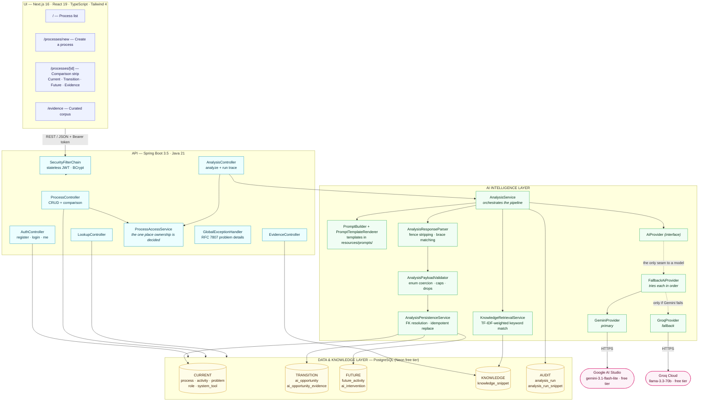
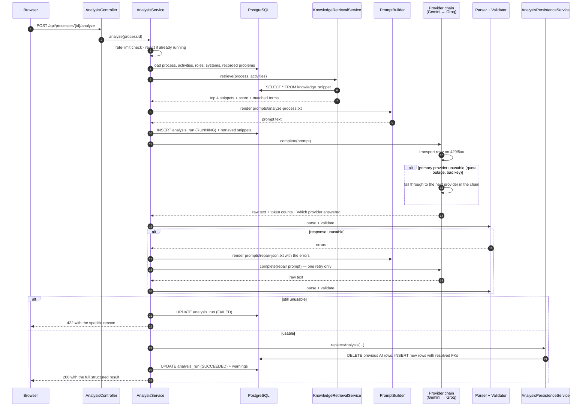

# Architecture

Four real layers, each running as its own process, each replaceable without rewriting the others.

> **Diagrams as images.** Every diagram below is also exported as a full-resolution PNG in
> [`docs/diagrams/`](diagrams/) — [system architecture](diagrams/system-architecture.png) ·
> [analysis pipeline](diagrams/analysis-pipeline-sequence.png) ·
> [deployment topology](diagrams/deployment-topology.png). The Mermaid source for each is checked
> in beside it as a `.mmd` file, so the diagrams are regenerated from the same text that renders on
> this page rather than redrawn by hand.

## The analysis pipeline, step by step

`POST /api/processes/{id}/analyze` is the only entry point, and it runs the same eight steps for
every process — seed data and a process created seconds ago by a judge take an identical path.

## Why these boundaries

| Boundary | Reason |
|---|---|
| `AiProvider` interface, with a chain behind it | The model call is the piece most likely to change — pricing, quotas, retirement. Isolating it meant that adding Groq as a fallback, after Gemini's free tier ran out mid-testing, was a new class plus a config value rather than a rewrite. The pipeline is unaware that failover exists. |
| Retrieval separate from prompting | Retrieval is deterministic and testable on its own; the prompt is text in a resource file. Neither needs the other to change. |
| Parsing and validation separate from persistence | Nothing untrusted reaches the database. The validator emits a normalised structure, and persistence only ever writes that. |
| Persistence in its own transactional bean | The model call takes tens of seconds and must not hold a database connection open — a real constraint on a serverless Postgres with a small connection allowance. |
| Ownership decided in one service | Every route touching a single process calls `ProcessAccessService`, so read rules and write rules cannot drift apart between endpoints. It returns 404 rather than 403 for someone else's process, because a 403 would confirm the id exists. |
| Stateless JWT rather than a session cookie | The frontend and API are on different sites (Vercel and Render). A session cookie would have to be `SameSite=None` third-party, which browsers increasingly block; a bearer token is unaffected. |
| Audit trail as first-class tables | "Not hard-coded" is a claim; `analysis_run.prompt_text` and `analysis_run.raw_response` make it checkable. |

## Deployment topology

The browser talks to both hosts directly: the frontend fetches client-side rather than
server-rendering, precisely because the free Render instance cold-starts in about a minute and a
server-rendered page would time out. The UI shows that as a "waking up" state instead.
