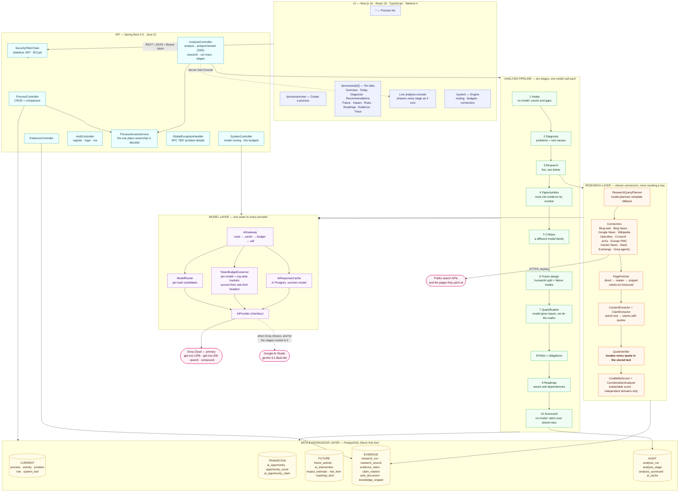
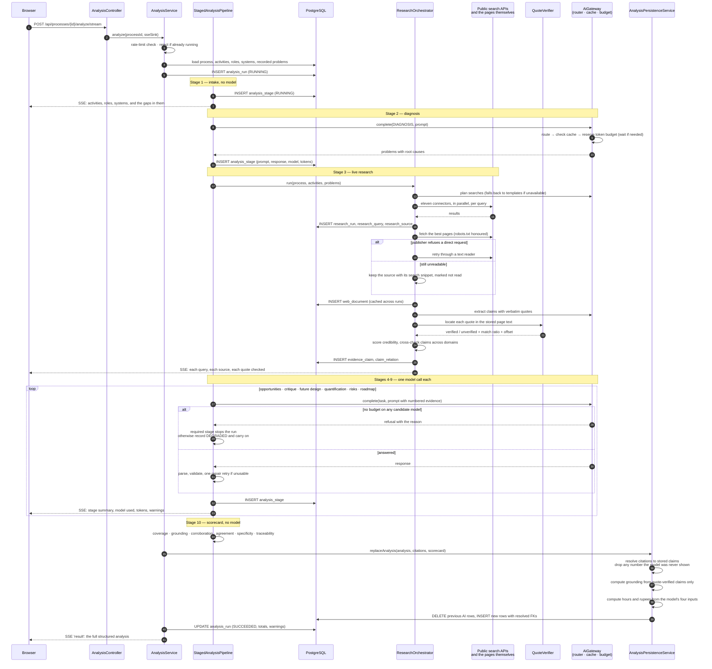
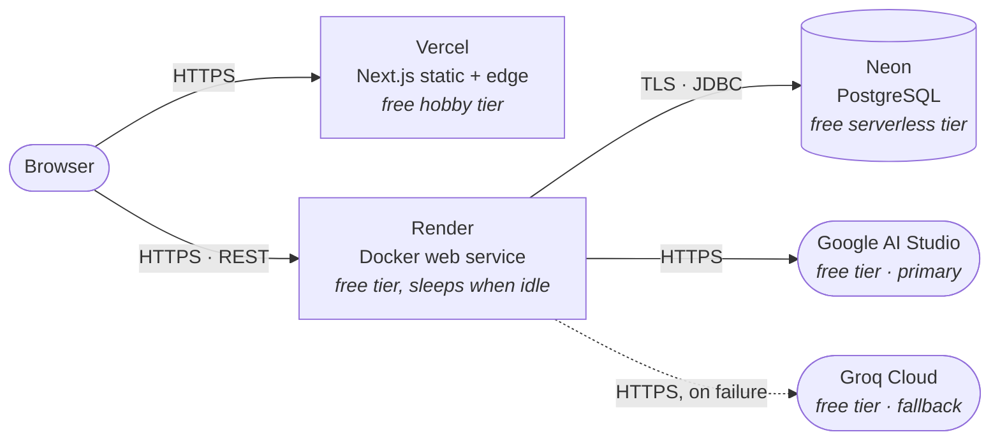

# Architecture

Four deployed layers — interface, API, intelligence, data — each running as its own process and
each replaceable without rewriting the others. Inside the intelligence layer there are three more
that are worth separating, because they fail differently: the **pipeline** that sequences ten
stages, the **research layer** that gathers evidence from the public web, and the **model gateway**
that is the single seam to any language model.

> **Diagrams as images.** Every diagram below is also exported as a full-resolution PNG in
> [`docs/diagrams/`](diagrams/) — [system architecture](diagrams/system-architecture.png) ·
> [analysis pipeline](diagrams/analysis-pipeline-sequence.png) ·
> [deployment topology](diagrams/deployment-topology.png). The Mermaid source for each is checked
> in beside it as a `.mmd` file, so the diagrams are regenerated from the same text that renders on
> this page rather than redrawn by hand.

## The analysis pipeline, stage by stage

`POST /api/processes/{id}/analyze` — or `/analyze/stream`, which is the same run reporting itself —
is the only entry point, and it runs the same ten stages for every process. Seed data and a process
created seconds ago by a reviewer take an identical path; there is no branch anywhere on which
process is being analysed.

| # | Stage | Model | What it contributes |
|---|---|---|---|
| 1 | Intake | none | Counts activities, roles and systems, and names the gaps in them |
| 2 | Diagnosis | GPT-OSS 120B | Problems, each with a root cause distinct from its symptom |
| 3 | Research | eleven connectors | Sources found, read, quoted and cross-checked. Deliberately **after** the diagnosis: knowing the real problem produces far better queries |
| 4 | Opportunities | GPT-OSS 120B | Interventions that cite the evidence by number |
| 5 | Critique | Qwen3 27B | A different model family judging the citations rather than the prose |
| 6 | Future design | GPT-OSS 120B | The ordered future process, with a failure mode per AI step |
| 7 | Quantification | Gemini / GPT-OSS | Four operational inputs; the arithmetic happens in Java |
| 8 | Risks | Qwen3 27B | The register, with controls, owners and any obligation the research established |
| 9 | Roadmap | Gemini / GPT-OSS | Delivery waves, dependencies, and the enabling work |
| 10 | Scorecard | none | Six ratios over the rows the run actually produced |

Only stages 2 and 4/6 are load-bearing. The rest degrade: a run that lost its roadmap is worth far
more to the person waiting than no run, and both the trace and the scorecard say what was lost.

## Why these boundaries

| Boundary | Reason |
|---|---|
| `AiProvider` interface, with a gateway in front of it | The model call is the piece most likely to change — pricing, quotas, retirement. It has now changed twice: Gemini's free tier ran out mid-testing, and Groq's default model was decommissioned outright. Both were configuration changes. The pipeline is unaware that routing, caching, budgeting or failover exist. |
| Routing, caching and budgeting in the gateway, not the stages | Ten stages would otherwise each need to know about token buckets and cache keys. Concentrating it means a stage asks for a *task* to be done and the gateway decides where, whether the answer is already known, and whether there is budget to ask right now. |
| Each connector its own class, behind one interface | Eleven third parties fail independently and differently. A connector that cannot answer returns an empty list rather than throwing, so one being blocked degrades a run instead of ending it — and adding a twelfth is one class. |
| Quote verification separate from claim extraction | The model does the part it is good at (recognising which sentences carry a finding) and is given no opportunity to do the part it is bad at (being the witness). The check is ordinary string matching in its own class, unit-tested against fabricated quotes. |
| Impact arithmetic separate from the stage that gathers its inputs | The model supplies volume, handling time, automation share and cost; the multiplication happens in `ImpactCalculator` where it is deterministic and checkable by hand. |
| Retrieval separate from prompting | Retrieval is deterministic and testable on its own; the prompt is text in a resource file. Neither needs the other to change. |
| Parsing and validation separate from persistence | Nothing untrusted reaches the database. The validator emits a normalised structure, and persistence only ever writes that. |
| Persistence in its own transactional bean | The model call takes tens of seconds and must not hold a database connection open — a real constraint on a serverless Postgres with a small connection allowance. |
| Ownership decided in one service | Every route touching a single process calls `ProcessAccessService`, so read rules and write rules cannot drift apart between endpoints. It returns 404 rather than 403 for someone else's process, because a 403 would confirm the id exists. |
| Stateless JWT rather than a session cookie | The frontend and API are on different sites (Vercel and Render). A session cookie would have to be `SameSite=None` third-party, which browsers increasingly block; a bearer token is unaffected. |
| Audit trail as first-class tables | "Not hard-coded" is a claim; ten `analysis_stage` rows holding the exact prompt and the exact response make it checkable. |
| Progress as an interface, with a no-op default | The streamed run and the plain run are the same run. Branching on whether anyone is watching would mean two code paths, one of which is only exercised in a demo. |

## Deployment topology

The browser talks to both hosts directly: the frontend fetches client-side rather than
server-rendering, precisely because the free Render instance cold-starts in about a minute and a
server-rendered page would time out. The UI shows that as a "waking up" state instead.
