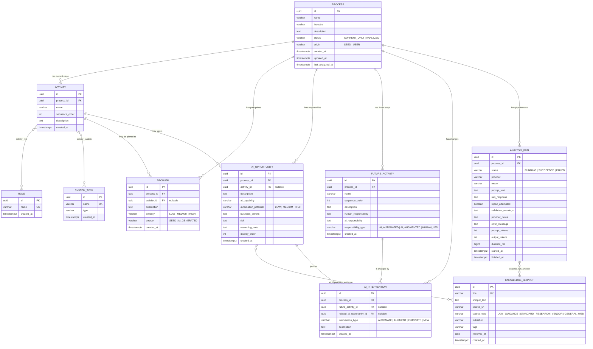

# Data model

The whole point of the schema is that the future process is **rows**, not prose. Every claim the
model makes lands in a typed column with a foreign key back to what produced it, so it can be
queried, counted and compared.

Defined in [`V1__baseline_schema.sql`](../backend/src/main/resources/db/migration/V1__baseline_schema.sql).

## Entity relationship diagram



## The chain the brief asks for

`Current → Activities → Problems → AI Opportunities → Future Process → Human vs AI → Benefit`
is a literal join path, not a narrative:

```sql
SELECT p.name                     AS process,
       a.name                     AS current_activity,
       prob.description           AS problem,
       prob.severity,
       op.description             AS ai_opportunity,
       op.automation_potential,
       op.business_benefit,
       fa.name                    AS future_activity,
       fa.responsibility_type,
       fa.human_responsibility,
       fa.ai_responsibility,
       i.intervention_type,
       ks.title                   AS supporting_source,
       ks.source_url
FROM process p
JOIN activity           a    ON a.process_id  = p.id
LEFT JOIN problem       prob ON prob.activity_id = a.id
LEFT JOIN ai_opportunity op  ON op.activity_id   = a.id
LEFT JOIN ai_intervention i  ON i.related_ai_opportunity_id = op.id
LEFT JOIN future_activity fa ON fa.id = i.future_activity_id
LEFT JOIN ai_opportunity_evidence e ON e.ai_opportunity_id = op.id
LEFT JOIN knowledge_snippet ks      ON ks.id = e.knowledge_snippet_id
WHERE p.name = 'Result Evaluation & Grading'
ORDER BY a.sequence_order, fa.sequence_order;
```

## Design decisions worth defending

**UUID keys generated in the application, not the database.** Keeps the schema portable across
Neon, Supabase and a local Postgres without depending on an extension, and lets the service build a
whole object graph before touching the database.

**`problem.source` distinguishes recorded from inferred.** Pain points captured with the process
definition are user data and survive a re-analysis; AI-generated ones are cleared and regenerated.
Without the column, re-running the analysis would either duplicate the business's own notes or
silently delete them.

**`ai_opportunity_evidence` is a join table, not a text field.** A citation is either a row pointing
at a real `knowledge_snippet`, or it does not exist. When the model cites a title that was never
supplied to it, the citation is dropped and the omission is recorded as a warning on the run — the
Evidence tab can never show a source that did not inform the analysis.

**Nullable `activity_id` on problems and opportunities.** A model observation can legitimately be
about the whole process. The alternative — forcing a link — would mean either dropping real findings
or pointing a foreign key at a guess.

**`analysis_run` and `analysis_run_snippet` exist purely for traceability.** They store the exact
prompt, the exact raw response, which snippets were retrieved, their relevance scores and matched
terms, whether the repair retry was needed, and the token counts. `provider` and `model` record who
actually answered — which, with a fallback chain, is not always who was asked first — and
`provider_notes` records why the earlier provider was passed over. This is what turns "the output is
generated, not hard-coded" from an assertion into something a judge can check with a SQL query.

**Deletes cascade from `process`.** One `DELETE FROM process WHERE id = ?` removes the activities,
problems, opportunities, future activities, interventions, evidence links and run history with it —
so a demo can be cleaned up without leaving orphans behind.

## Sizes and constraints

Enum-valued columns are `VARCHAR` with `CHECK` constraints rather than native Postgres enums:
adding a value later is a plain migration instead of a type alteration, and the values stay
readable in `psql`. The Java enums and the check constraints are kept in step by
`AnalysisJsonSchema`, which builds the model's response schema from the same enum classes — a test
asserts they match, so the three cannot drift apart silently.
