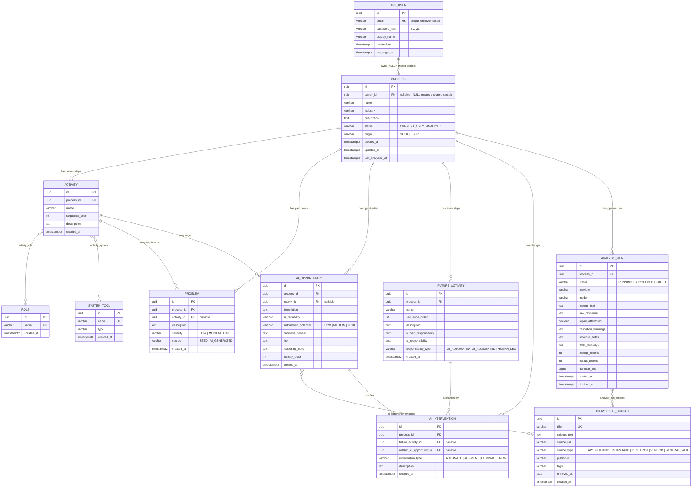

# Data model

The whole point of the schema is that the future process is **rows**, not prose. Every claim the
model makes lands in a typed column with a foreign key back to what produced it, so it can be
queried, counted and compared.

Defined in [`V1__baseline_schema.sql`](../backend/src/main/resources/db/migration/V1__baseline_schema.sql).

> **The ER diagram as an image:** [`diagrams/entity-relationship-diagram.png`](diagrams/entity-relationship-diagram.png)
> — full resolution, with the Mermaid source checked in beside it.

## Entity relationship diagram



## The chain the brief asks for

`Current → Activities → Problems → AI Opportunities → Future Process → Human vs AI → Benefit`
is a literal join path, not a narrative:

```sql
SELECT p.name                     AS process,
       a.name                     AS current_activity,
       prob.description           AS problem,
       prob.severity,
       op.description             AS ai_opportunity,
       op.automation_potential,
       op.business_benefit,
       fa.name                    AS future_activity,
       fa.responsibility_type,
       fa.human_responsibility,
       fa.ai_responsibility,
       i.intervention_type,
       ks.title                   AS supporting_source,
       ks.source_url
FROM process p
JOIN activity           a    ON a.process_id  = p.id
LEFT JOIN problem       prob ON prob.activity_id = a.id
LEFT JOIN ai_opportunity op  ON op.activity_id   = a.id
LEFT JOIN ai_intervention i  ON i.related_ai_opportunity_id = op.id
LEFT JOIN future_activity fa ON fa.id = i.future_activity_id
LEFT JOIN ai_opportunity_evidence e ON e.ai_opportunity_id = op.id
LEFT JOIN knowledge_snippet ks      ON ks.id = e.knowledge_snippet_id
WHERE p.name = 'Result Evaluation & Grading'
ORDER BY a.sequence_order, fa.sequence_order;
```

The chain now extends one step further back, to the page a recommendation rests on and whether its
quote was actually found there:

```sql
SELECT left(op.description, 70)  AS recommendation,
       op.grounding_score,
       sc.verdict                AS reviewer_verdict,
       c.citation_index,
       c.quote_verified,         -- the whole trust model, in one boolean
       c.corroboration_count,    -- independent domains only
       src.domain,
       src.source_type,
       src.credibility_score,
       left(c.quote, 90)         AS quote,
       doc.url                   AS page_the_quote_was_checked_against
FROM ai_opportunity op
JOIN process p                   ON p.id = op.process_id
LEFT JOIN opportunity_score sc   ON sc.ai_opportunity_id = op.id
LEFT JOIN ai_opportunity_claim l ON l.ai_opportunity_id = op.id
LEFT JOIN evidence_claim c       ON c.id = l.evidence_claim_id
LEFT JOIN research_source src    ON src.id = c.research_source_id
LEFT JOIN web_document doc       ON doc.id = src.web_document_id
WHERE p.name = 'Result Evaluation & Grading'
ORDER BY op.display_order, c.citation_index;
```

And the business case, with the inputs it was computed from rather than only its conclusion:

```sql
SELECT ie.label,
       ie.volume_per_month, ie.minutes_per_item,
       ie.automation_share, ie.hourly_cost_inr,      -- what the model supplied
       ie.hours_saved_per_month,
       ie.cost_saved_per_month_inr,
       ie.payback_months,                            -- what this application computed
       ie.basis                                      -- MODEL_ESTIMATE or USER_SUPPLIED
FROM impact_estimate ie
JOIN process p ON p.id = ie.process_id
WHERE p.name = 'Result Evaluation & Grading'
ORDER BY ie.display_order;
```

## Design decisions worth defending

**`process.owner_id` is nullable, and the null means something.** A row with an owner is private
to that account; a row without one is a shared sample that everyone can read and analyse and
nobody can edit or delete. Encoding "shared" as the absence of an owner rather than as a separate
boolean keeps the two facts from ever disagreeing, and lets the visibility rule be a single clause
in the listing query: `where p.owner.id = :me or p.owner is null`.

Everything downstream — activities, problems, opportunities, future activities, interventions,
analysis runs — inherits its scope through the process foreign key, so no other table needs an
owner column. `knowledge_snippet`, `role` and `system_tool` stay deliberately global: they are
reference data, not user content.

**UUID keys generated in the application, not the database.** Keeps the schema portable across
Neon, Supabase and a local Postgres without depending on an extension, and lets the service build a
whole object graph before touching the database.

**`problem.source` distinguishes recorded from inferred.** Pain points captured with the process
definition are user data and survive a re-analysis; AI-generated ones are cleared and regenerated.
Without the column, re-running the analysis would either duplicate the business's own notes or
silently delete them.

**Citations are join tables, not text fields.** `ai_opportunity_claim` and `risk_item_claim` point
at real `evidence_claim` rows, and `ai_opportunity_evidence` at the curated corpus. A citation is
either a row or it does not exist. When the model cites a number it was never shown, the citation is
dropped and the omission recorded as a warning — nothing in the interface can display a source that
did not inform the analysis.

**`evidence_claim.quote_verified` is the most consequential boolean in the schema.** It is set by
locating `quote` inside `web_document.content_text`, not by asking a model. `quote_start` records
where, so the interface can highlight it in place, and `quote_match_ratio` records how much matched
for the near-misses. Everything downstream keys off it: `ai_opportunity.grounding_score` counts only
verified claims, and the scorecard's grounding component is the share of recommendations citing at
least one.

**`web_document` is separate from `research_source`, and shared across runs.** A source is what one
run found; a document is the page itself, cached for a week and keyed by a canonicalised URL hash so
that two links differing only by a tracking parameter are one page. Keeping the text is not an
optimisation — it is what makes quote verification possible after the fact, and what makes a run
reproducible when the page has since changed.

**`claim_relation.same_domain` decides whether a relation counts.** Two claims from one publisher
agreeing is one source with two URLs. The row is still stored, because it is a fact about the
corpus, but corroboration counts only where this is false.

**`impact_estimate` stores inputs beside outputs, and `basis` beside both.** "Saves 1,240 hours a
month" is unarguable in the unhelpful sense; the volume, handling time and automation share it came
from can be argued with. `basis` distinguishes a figure a person supplied from one a model
estimated, and the interface never renders the two the same way.

**`analysis_stage` is one row per stage, not one blob per run.** Ten rows carrying the exact prompt,
the exact response, which model answered, what it cost and how long it waited for rate-limit budget.
That is what makes "no giant single prompt" checkable rather than asserted, and it is also what makes
a disappointing analysis debuggable: a thin result traces to the stage that produced thin input.

**`analysis_scorecard` is computed, never asserted.** Six ratios over stored rows. It is allowed to
be low, and `metrics` keeps the raw counts so the arithmetic can be redone by hand.

**Nullable `activity_id` on problems and opportunities.** A model observation can legitimately be
about the whole process. The alternative — forcing a link — would mean either dropping real findings
or pointing a foreign key at a guess.

**`analysis_run` carries the run's cost as columns, not as a sum to compute on read.** Total tokens,
how many stages were served from cache at no quota cost, and how long the run spent waiting on
free-tier budget rather than on models thinking. On a free tier those are operational facts, asked
far more often than they change. `provider` and `model` record who actually answered — with a
fallback chain, not always who was asked first — and `provider_notes` records why the earlier one was
passed over.

**Deletes cascade from `process`.** One `DELETE FROM process WHERE id = ?` removes the activities,
problems, opportunities, future activities, interventions, evidence links and run history with it —
so a demo can be cleaned up without leaving orphans behind.

## What V5 added

The fourteen tables introduced with live research and the staged pipeline, grouped by what they are
for. Full DDL with the reasoning inline is in
[`V5__research_and_pipeline.sql`](../backend/src/main/resources/db/migration/V5__research_and_pipeline.sql).

| Group | Tables | What they hold |
|---|---|---|
| Research | `research_run`, `research_query`, `research_source`, `web_document` | What was searched, what was found, what could be read, and the page text itself |
| Evidence | `evidence_claim`, `claim_relation`, `ai_opportunity_claim`, `risk_item_claim` | Quoted, verified, cross-checked claims, and the citations pointing at them |
| Pipeline | `analysis_stage` | One row per stage: prompt, response, model, tokens, wait, status |
| Output | `opportunity_score`, `impact_estimate`, `risk_item`, `roadmap_item` | The adversarial review, the business case, the risk register, the delivery plan |
| Measurement | `analysis_scorecard` | Six computed quality components per run |
| Cost | `ai_cache` | Remembered model responses, so a restart does not discard spent quota |

V5 also widened the existing tables: `ai_opportunity` gained a root cause, the human-oversight
statement, the data it requires, a success metric and a grounding score; `future_activity` gained a
handoff note, a failure mode, the activity it replaces and a cycle-time note; `problem` gained a root
cause and an evidence note; and `analysis_run` gained the pipeline telemetry described above.

## Sizes and constraints

Enum-valued columns are `VARCHAR` with `CHECK` constraints rather than native Postgres enums:
adding a value later is a plain migration instead of a type alteration, and the values stay
readable in `psql`. The Java enums and the check constraints are kept in step by
`AnalysisJsonSchema`, which builds the model's response schema from the same enum classes — a test
asserts they match, so the three cannot drift apart silently.
